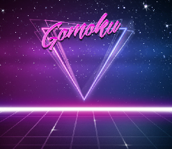

# Gomoku

> Gomoku ehk "Viis nuppu ritta" on Jaapani lauamäng. 
Klassikalise mängulaua suurus on 18x18, kuid võib mängida ka väiksemal mängulaual. 
Tavaliselt kasutatakse Gomokus musti ja valgeid nuppe, kus alustaval 
mustal on väike eelis, kuid niisama mängides pole see märgatav.
Professionaalset varianti Gomokust nimetatakse rendžuks.
## Ajalugu

## Teostus
