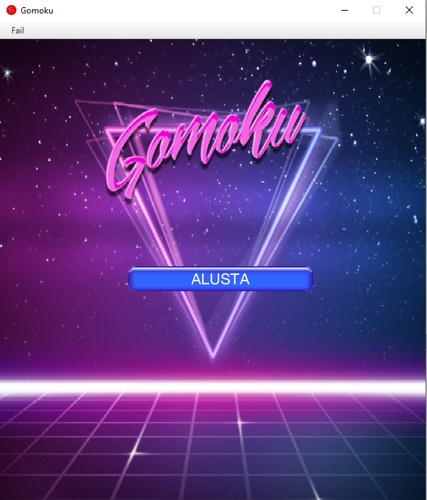
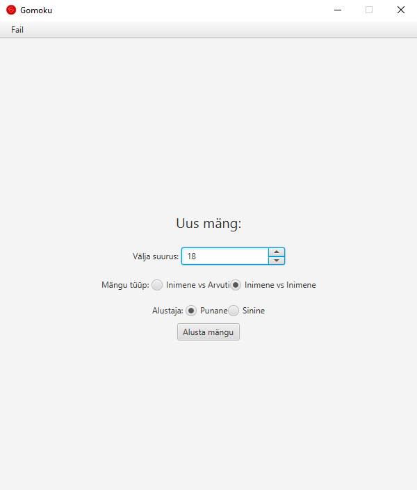
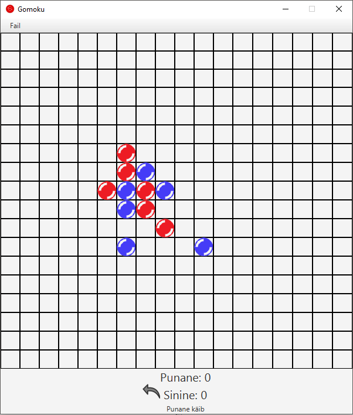

# Gomoku

 
## Mis see on?

Gomoku ehk "Viis nuppu ritta" on Jaapani lauamäng. 
Klassikalise mängulaua suurus on 18x18, kuid võib mängida ka väiksemal mängulaual. 
Mängu võitmiseks on tarvis saada järjestikku ritta horisontaalselt, vertikaalselt või diagonaalselt 5 nuppu. 
Tavaliselt kasutatakse Gomokus musti ja valgeid nuppe, kus alustaval 
mustal on väike eelis, kuid niisama mängides pole see märgatav.
Professionaalset varianti Gomokust nimetatakse rendžuks.

## Teostus

Mäng on kirjutatud Java keeles ning graafiline pool on teostatud kasutades Java FX teeki.

## Kuidas mängida

Kõige lihtsam viis mängimiseks on tõmmata pakitud fail [gomoku.jar](gomoku.jar) ning see käivitada. 
Loomulikult saab mängida ka laadides alla kogu projekt ning käivitada see kas käsurealt või siis avada see mõnes IDE-s, 
mis mõlemad eeldavad eelnevalt paigaldatud Java olemasolu.

Mängu käivitades avaneb kõigepealt avavaade.

Vajutades nupule "Alusta mängu" on võimalik seadistada endale sobiv mäng.
Valida saab:
* mänguvälja suurust max. 40x40
* mängu tüüpi - kas inimene vs arvuti või inimene vs inimene
* alustava mängija värvi 

Vajutades taaskord nupule "Alusta mängu" luuakse soovitud mängulaud ning mäng võib alata.

## Mängu loogika
Arvuti mängib vastu antud loogikaga if lausetes:
1. Vaatab kas saab mängu võita - panna 5nda klotsi
2. Vaatab kas saab vastast takistada otse võitmast - paneb talle ette 5nda
3. Vaatab kas saab panna endale 4 järjest.
4. Vaatab kas saab vastast takistada panemast 4. järjest.
jne...
kuni vaatab, kas punasel on üldse 1 nupp laual

Arenemisfaasis, arvuti ei oska panni klotsi kahe vastase klotsi vahele, kui vaja.
Kompleksed olukorrad, kus võidukäigud ei tundu isegi tavainimesele loogilised.

Palju meetodite kopeerimisi, kuna arenemisfaasis tuleks if lausete struktuur selgemalt välja.
Tulevikus kindlasti muutmiseks.

## Mängu kontroll
Loeme käigud massiivi. Tehtud on meetodid, mis tuvastavad antud massiivis 5 järejstikust
elementi vastavalt diagonaalis, horisontaalselt, vertikaalselt.
Kerge on kontrollida käidud ruudu ümbert - vähem arvutamistööd arvutile.
